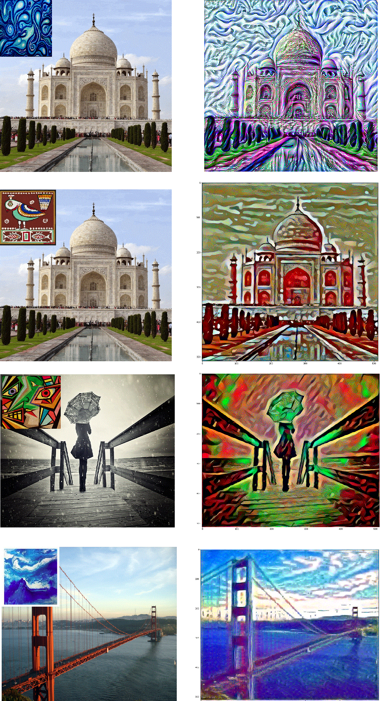
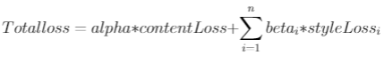

# Neural Style Transfer

This is an implemention of the paper _[A Neural Algorithm of Artistic Style](https://arxiv.org/abs/1508.06576)_ in python using tensorflow library. Neural Style Transfer refers to the introduction of artistic style of one image (Style Image) into another image (Content Image). Additionally, some further extensions have been made in the implementation.

---

## Instructions

To start using this project, first install the dependencies as mentioned in requirement.txt. To install the dependencies, open command propmt or terminal and run the following command - 

```
pip install -r requirements.txt
```

After this, run the jupyter notebook Neural_Style_Transfer.ipynb. You can use your own images by changing the directories for the content and style images in the respective cells of the notebook. (Keep the style and content images in the input folder and update it in the notebook cell).

---

## Outputs
Some sample outputs are shown below :

<br>

<p align = "center">
    
</p>

(Image in the inlet is the style image)

---

## Conversion Video
Here is a small video to see the working of Neural Style Transfer.

<p align = "center">
    
</p>

<p align = "center">
    
</p>

---

## Some Extension to the paper

Two small extensions were made in this implementation
* Transfering style of multiple image into the content image.
    
   * This is done by changing the style loss function slightly :
    <p align = "center">
        
    </p>
 
   * Here n is the number of images, and beta_i's are the weights assigned to each image

<br>
<br>

* Applying style to selected parts of the content image.

    * This is done by breaking the image into 4 parts and then applying style transfer to these parts individually.
    <br>
    <p align = "center">
        
    </p>

---

## License

This project is distributed under [MIT license](https://opensource.org/licenses/MIT). Any feedback, suggestions are higly appreciated.


